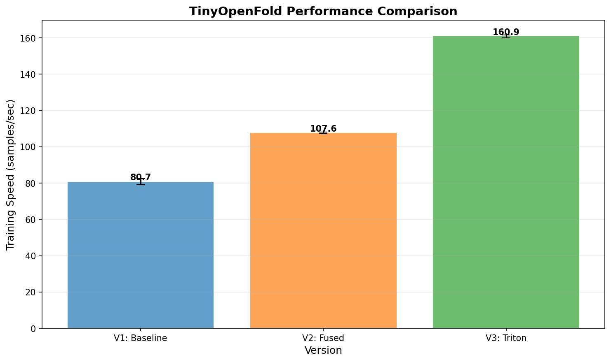
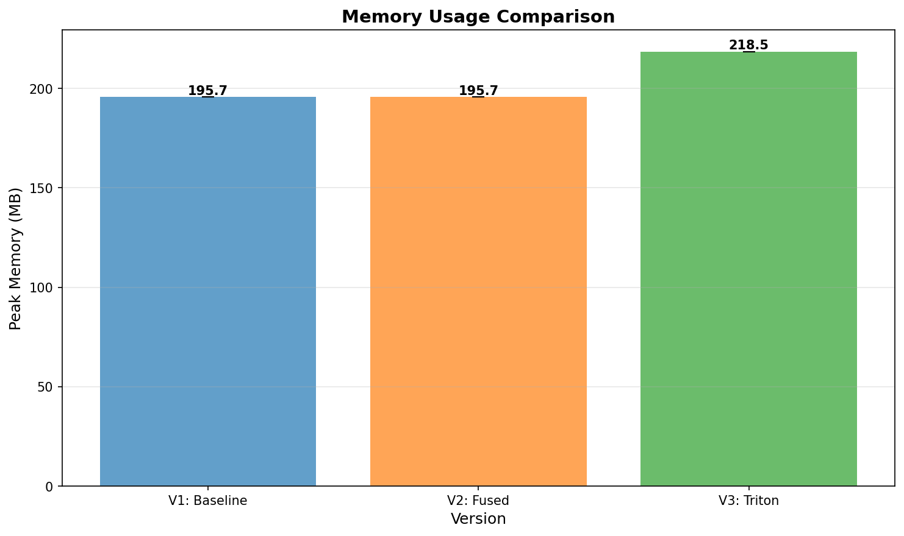

# TinyOpenFold Performance Study Results

**Study Date**: 20251120_173520

**Configuration**:
- Batch size: 4
- Sequence length: 64
- Training steps: 50
- Runs per version: 3

## Performance Summary

| Metric | V1 Baseline | V2 Fused | V3 Triton | V3 vs V1 |
|--------|-------------|----------|-----------|----------|
| Training Speed (samples/s) | 80.7 | 107.6 | 160.9 | 1.99x |
| Peak Memory (MB) | 195.7 | 195.7 | 218.5 | -11.7% reduction |
| Batch Time (ms) | 49.6 | 37.2 | 24.9 | 1.99x faster |

## Detailed Results

### V1_BASELINE

| Metric | Mean | Std Dev | Min | Max |
|--------|------|---------|-----|-----|
| Training Speed (s/s) | 80.75 | 1.67 | 78.38 | 81.94 |
| avg_batch_time (ms) | 49.56 | 1.04 | 48.81 | 51.04 |
| avg_forward_time (ms) | 17.97 | 0.08 | 17.87 | 18.07 |
| avg_backward_time (ms) | 27.40 | 0.83 | 26.76 | 28.57 |
| avg_optimizer_time (ms) | 4.19 | 0.14 | 4.08 | 4.39 |
| Peak Memory (MB) | 195.7 | 0.0 | 195.7 | 195.7 |

### V2_FUSED

| Metric | Mean | Std Dev | Min | Max |
|--------|------|---------|-----|-----|
| Training Speed (s/s) | 107.62 | 0.49 | 107.04 | 108.23 |
| avg_batch_time (ms) | 37.17 | 0.17 | 36.96 | 37.37 |
| avg_forward_time (ms) | 14.77 | 0.16 | 14.63 | 14.99 |
| avg_backward_time (ms) | 19.12 | 0.07 | 19.04 | 19.20 |
| avg_optimizer_time (ms) | 3.28 | 0.01 | 3.26 | 3.30 |
| Peak Memory (MB) | 195.7 | 0.0 | 195.7 | 195.7 |

### V3_TRITON

| Metric | Mean | Std Dev | Min | Max |
|--------|------|---------|-----|-----|
| Training Speed (s/s) | 160.85 | 0.87 | 160.15 | 162.07 |
| Peak Memory (MB) | 218.5 | 0.0 | 218.5 | 218.5 |
| avg_batch_time (ms) | 24.87 | 0.13 | 24.68 | 24.98 |
| avg_forward_time (ms) | 14.48 | 0.13 | 14.29 | 14.57 |
| avg_backward_time (ms) | 8.29 | 0.00 | 8.28 | 8.29 |
| avg_optimizer_time (ms) | 1.49 | 0.01 | 1.48 | 1.50 |

## Key Findings

1. **Performance**: Version 3 achieves 1.99x speedup over baseline
2. **Memory**: -11.7% reduction in peak memory usage
3. **Optimizations**: Triton custom kernels provide significant improvements

## Plots

